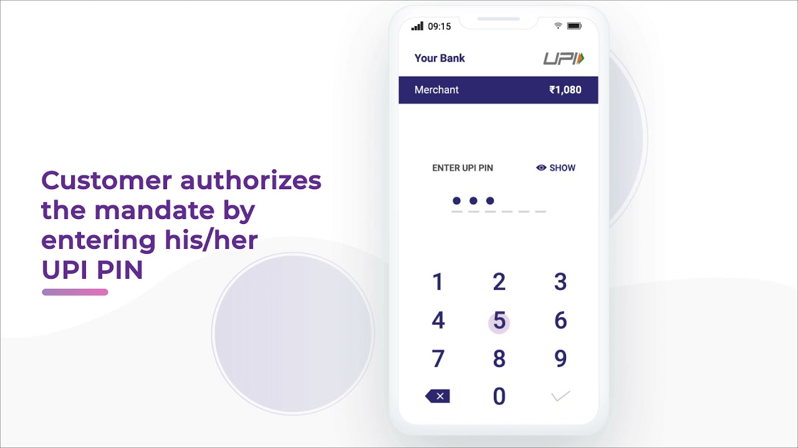
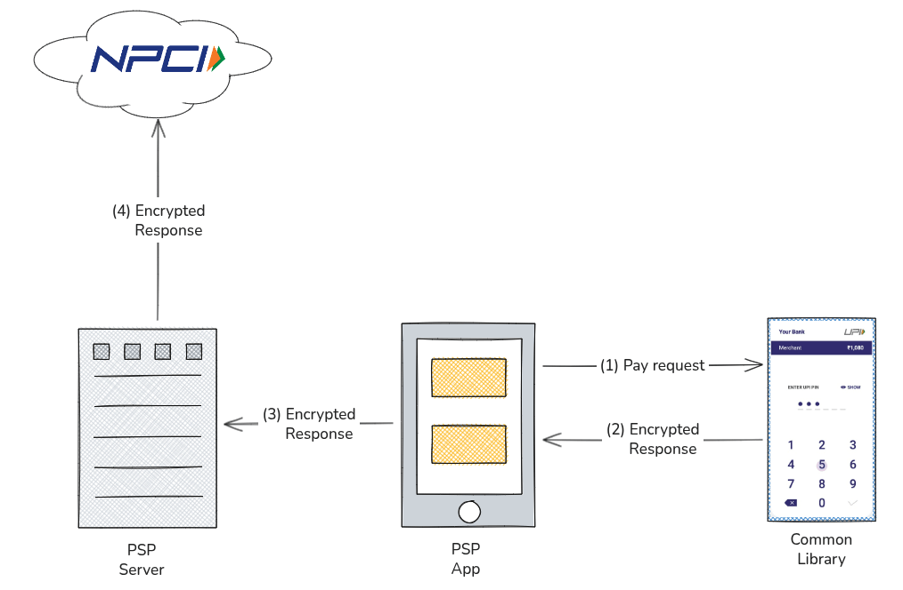
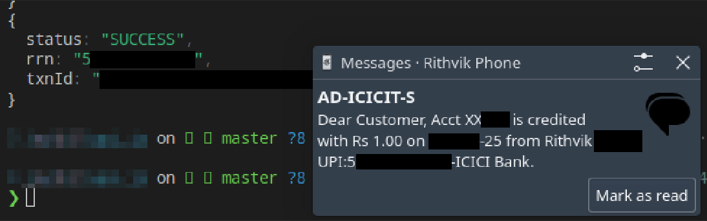

import { Image } from "astro:assets";

UPI is everywhere now, it’s basically infrastructure. But it’s the kind of infra you’re only allowed to use, not extend.

## UPI?

If you haven't heard about UPI (_Unified Payments Interface_), it's India's **instant**, real-time payment system that lets anyone **send and receive money** directly between bank accounts in seconds.
All you need is the recipient's _bank-linked mobile number_ or their _email-like "UPI ID"_. Merchants can immediately start accepting payments by printing a QR code on a sheet of paper.

import upiLogo from "./images/upi-logo.png";

<Image
  src={upiLogo}
  alt="UPI Logo"
  width={300}
  class="mx-auto"
/>

UPI launched in 2016 (~10 years ago) and currently accounts for **~85% of all digital payments** in India. In fact, it processes more transactions (_~650M/day_) than Visa does globally (_~635M/day_)!

The tech works and is pretty cool. It's also surprisingly open (within the system): any financial institution can integrate UPI into their app.

**BUT.**

What would make it even better?

## Interop.

Imagine walking into a store wearing your **AR glasses**, pointing at a QR code, and **confirming a payment** directly from your glasses.

Imagine **accessibility-first UPI apps**, or even **unique form factors** of hardware to make sure everyone has easy access to their bank accounts.

Imagine a **tiny hardware wallet** ~~like the Rabbit R1~~ that you can carry instead of a wallet full of cash. (_yes, cards are thinner, but reminder: UPI is way more widely accepted than cards_)

Imagine having **programmatic access** to your bank account.
- Build an integration to automatically **settle your Splitwise** with friends
- Make a **Raycast extension** to pay anyone without taking out your phone
- **Get notified** of receiving payments in your account and act on them, in code

The possibilities are endless.

The only problem is, **only financial institutions** get access to the UPI network. This is **for very good reason**. They are regulated, undergo extensive audits, ensure various security measures are in place, and that keeps all their customers' accounts safe and secure.

Unfortunately, this makes it _hard / impossible_ to make UPI interoperable and build on it. To be clear, payment gateways support UPI and that's great; but _anything_ more than the basics simply cannot exist.

**Unless...**

Over the last few years, a handful of people have been looking into how **the UPI stack** works by [poking it with a stick](https://x.com/vxunderground/status/1986183682571575360) and trying to make it builder-friendly.

## How does it work exactly?

There have been research papers and articles about it, but I'll summarize them here.

### Common Library

The organization that runs UPI, National Payments Corporation of India (**NPCI**), distributes a compiled library blob to authorized banks certified on UPI and their partnered Payment Service Providers (**PSPs**) or Third-Party Application Providers (**TPAPs**).

The **UPI PIN** screen you see in all the apps when making payments is a screen from this library, called Common Library (**"CL"**). It handles _device enrollment_, _secure PIN entry_, _encrypting requests_ that are sent to banks, and _storage of secrets_. Since the library handles credential input (UPI PIN, etc.), none of the apps can read the clear-text secret inputs.

> A **UPI PIN** is a 4-6 digit secret that users set for their bank accounts. This is required to approve every transaction.
>
> **Fun fact:** NPCI has recently approved biometric (fingerprint / face) authentication and is gradually rolling out across apps and banks!

### PSPs

When a payment needs to be made, or balance checked, the **apps call methods in CL**, which **collects inputs** securely, and returns an **encrypted response**. This is sent to NPCI / the UPI network through the app's API/servers.

## The RE.

With this understanding of the system, would it be possible to create our own UPI client? Turns out, a bunch of folks have independently been attempting this exact thing.

There are **two** known implementations of the Common Library:
1. [52 Labs / Librefin](https://52-1ab.github.io) has published a version of [CL written in Go](https://github.com/52-1ab/cl), with bindings to many languages. They also presented at IndiaFOSS 2025, go check out [their talk](https://www.youtube.com/live/_wbqbblIexY?t=19320s)!
2. [upi.js](https://github.com/rithvikvibhu/upi.js) by _yours truly_, which is a modular TypeScript library to work with UPI.

> This is reverse-engineering a closed financial system. It might violate PSP terms of service, and NPCI probably wouldn't endorse it. Depending on how and where it's used, it may be legally risky. This post is about understanding the system and exploring what's _possible_, not encouraging anyone to deploy this in production with real money.

## Isn't this really unsafe?!

To be very explicit and clear: **YES.**

By using an unofficial client without any proper security audits, there's always **more risk**. The secret store may be compromised. There might be a flaw in either the CL code, or related code, or anything built on top of it.

Some of it can _and should be_ addressed:
- Secrets can be stored in secure storage:
	- The AR glasses example? Apple uses Optic ID (iris verification) on the Vision Pro to unlock the secure enclave
	- The APIs? secrets stored in the OS' Keychain
- hardware device? maybe still has pin entry

But they'll **likely never be more secure** than a non-rooted Android phone with strong attestation, or a non-jailbroken iPhone. Again, the official apps have good reason to add all the checks.

**With that said.**

Here's a (paraphrased) snippet from the [same talk (timestamped)](https://youtu.be/_wbqbblIexY?t=19981) linked above, I couldn't have said it better than Nemo:

> If I choose to do this, I’m moving away from things like Play Store integrity checks, iOS DRM, anti-root checks, and a bunch of other device checks that UPI or similar systems might require. I’m giving those up in exchange for what I’d call software freedom, and I’m doing that knowingly.
>
> This is an opt-in decision. If you're happy with the existing UPI apps, that’s totally fine, feel free to keep using them. But if I want more freedom in how I operate my bank accounts, I can choose to take on a small, limited amount of financial risk.
>
> For example, I might use this with a secondary bank account that only has a small balance. I could run this on an ESP32 (which doesn't have encrypted storage). If that device gets stolen and someone gets the keys, sure, I might lose a bit of money, but I’m okay with that trade-off for the freedom I get.

## Build your own UPI app

If you've been paying attention (good job making it this far!), you're probably wondering about the _missing half_.

The recipe to work with UPI requires these ingredients:
1. Common Library
2. A way to interact with the UPI network

Like we talked about earlier, **only permitted entities** get access to the network. To complete our client, we need to be able to interact with the network through one of these permitted entities. So, just like how the apps communicate with their servers, we can write similar clients that talk to the same servers, making the **same requests that the apps do**.

As you might be thinking, every PSP works differently, even if they are built around the same CL. **This client is what needs to be written** to get our UPI stack online:

### Writing PSP clients

One way to do this is with `upi.js`. It's a modular library that:
- includes an implementation of **Common Library**
- supports pluggable **PSP Clients** (what you're about to write)
- wraps them into neat high level functions to pay, collect, check balance, etc.

Check out the [project on GitHub](https://github.com/rithvikvibhu/upi.js) for more info including how to use.

The main (and only) requirement to create PSP Clients is implementing [the PSPClient interface](https://github.com/rithvikvibhu/upi.js/blob/master/src/types.d.ts). There is a [MockPSP](https://github.com/rithvikvibhu/upi.js/blob/master/src/psps/mock/index.ts) included for reference.

Since every PSP is different, I'll not go into detail on any specific app. Instead, here's some tips that generally apply to all apps.

### Tips

- **Android > iOS**

  As an Android user I might be a bit biased here, but it's usually easier to inspect and debug android apps. But whatever floats your boat.

- **Decompile the app**

  **jdax** / **jdax-gui** is your friend. Look for interesting strings that the app shows and follow the trails.

- **Root Detection**

  Most (all?) apps have some form of root detection. Either patch the apps with **apktool** to disable these checks, or find a way to hide root (**MagiskHide** / **Shamiko**, etc.)
  If apps check for Play Integrity, try older android versions, **Play Integrity Fix**, etc.

- **Network Inspection**

  I personally find it easiest to start with observing network traffic. See what requests are sent when performing different actions in the app. **Burp** / **Charles** / **Fiddler** / **Mitmproxy**, whatever you prefer.

- **SSL Pinning**

  Apps usually pin to and look for a specific certificate from the server before connecting. This means the self-generated certs from the proxies above will almost always be rejected, even if the android system trusts it. To be able to see clear-text network traffic, either bypass SSL pinning with **Frida** (look for modules online), or patch the **smali code** and rebuild the app.

- **Payload Encryption**

  Some apps like to encrypt request and response bodies. The key / cipher / rotation can vary, the best source to identify this is in the decompiled source.

## The Future

With more folks showing interest, I think we might see a repository of community-maintained PSP clients. If you're curious, start by writing a PSP client for your favorite app. Even partial progress can help others complete it.

I'm excited to see what's going to be built on top of this stack! What kind of crazy ideas will *you* bring to life?
