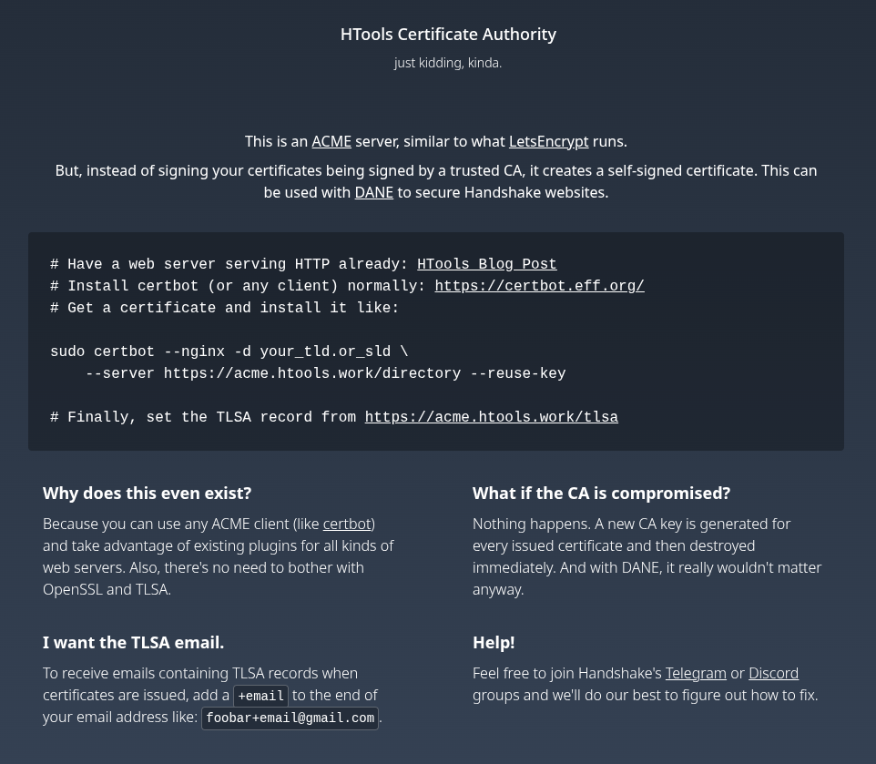

import LinkCard from "../../components/LinkCard.astro";

This is an [ACME](https://en.wikipedia.org/wiki/Automated_Certificate_Management_Environment) server, similar to what [LetsEncrypt](https://letsencrypt.org) runs.

Where it differs is that instead of your certificates being signed by a trusted Certificate Authority, they are signed by a single-use CA. Every certificate issued is signed by an ephemeral keypair.

#### But WHY?

If you haven't heard of [DANE](https://en.wikipedia.org/wiki/DNS-based_Authentication_of_Named_Entities), it's a way to secure your website with self-signed certificates, without being blessed by anyone else. The chain of trust is rooted in DNS (with DNSSEC securing it).

This server makes it easy to plug in DANE into existing web hosting infra with the tools you love. It works with any web server (nginx, apache, caddy) and any ACME client (like certbot).

#### Stateless DANE

All that's nice, but where it really shines is when securing [Handshake](https://handshake.org) websites. The server also attempts to embed [Stateless DANE](https://hsd-dev.org/HIPs/proposals/0017/) proofs as TLS extensions in the certificate.

Stateless DANE requires certificates to be renewed frequently (think ~daily) and the standard ACME protocol is a perfect fit for this.

#### Try it out!

For a full (but still short) guide on how to use this:

<LinkCard
  title="Stateless DANE websites with Caddy"
  description="Set up a Stateless DANE website in ~15 minutes with Caddy!"
  href="https://blog.htools.work/posts/stateless-dane-caddy/"
/>
