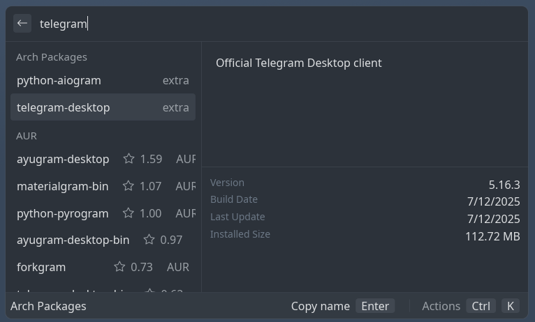

Plugin for [Gauntlet](https://github.com/project-gauntlet/gauntlet) to search for Arch and AUR packages.



### Usage

Install it like any other gauntlet plugin:

1. Open **Gauntlet Settings** -> **Plugins** -> **+** button
2. Paste this:
   ```
   https://github.com/rithvikvibhu/gauntlet-plugin-arch-pkgs
   ```
3. Press **Download Plugin**
