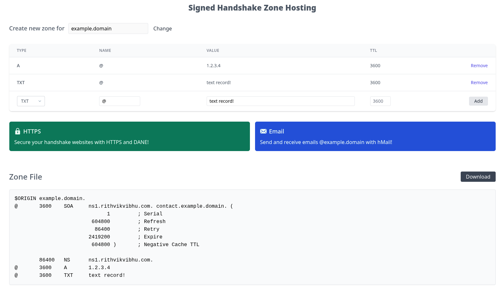
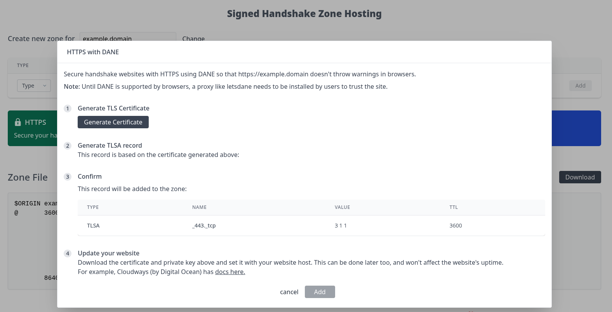

This is a platform for hosting DNSSEC-signed DNS zones.

## Why

Hosting a DNS zone with a provider usually means that the provider _is in control of the zone_. If/when the provider is compromised, the zone can be modified with malicious intent.

Self-hosting DNS is an option (I run a few!), but is non-trivial work of maintaining nameservers, uptime, and security.

**The middleground:**

Zones can be **signed with [DNSSEC](https://www.cloudflare.com/en-in/learning/dns/dnssec/how-dnssec-works/)**, but the provider does not need to have access to the keys to sign the zone. This is what Signed Zone Hosting does.

## How it works

_Anyone_ can upload signed zone files, and the nameserver will serve the zone.

There is _no authentication_. Updating the zone is as simple as uploading a new zone file. As long as the DS record for the signing key is set, the zone gets updated.

This service can also be used as DNS hosting for [Handshake](https://handshake.org) domains, making it possible secure them with [DANE](https://en.wikipedia.org/wiki/DNS-based_Authentication_of_Named_Entities).

## Why it's secure

The zone is signed on your computer and the private keys are never uploaded.

As any resolver that validates DNSSEC will look for a corresponding DS record, it is impossible for the zone to be modified without access to the private key.

## The Zone Editor

Editing zone files is a pain. Use the built-in editor to manage the zone.

It's also possible to easily add DANE (generates TLS certificates and adds TLSA records). Everything runs in the browser and the TLS keys do not leave the browser.

## Try it out!

[Get Started](https://signed-zone-hosting-git-master-rithvikvibhu.vercel.app/getstarted) if you already have a zone file.

Or [Create a new one](https://signed-zone-hosting-git-master-rithvikvibhu.vercel.app/create).
