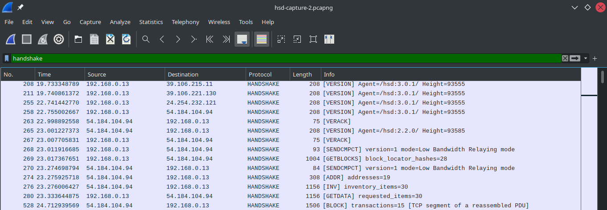
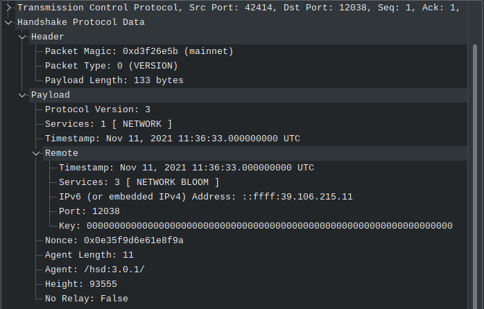
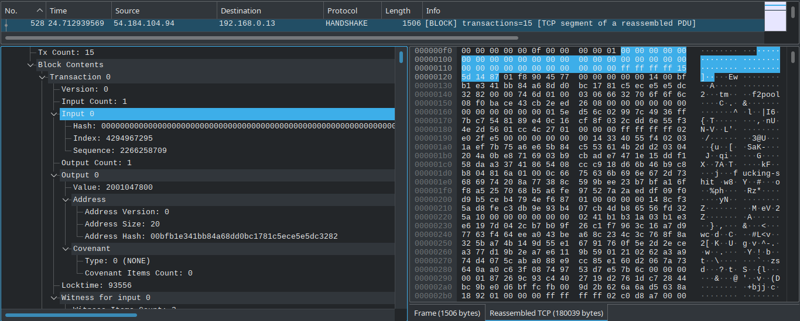

This is a Wireshark dissector written in Lua to decode the [Handshake](https://handshake.org) P2P protocol.

It helps in debugging and analyzing Handshake network traffic.

### Packet List

The info column shows the summary of the packet:

### Packet Detail

Each frame shows packet-level protocol data:

The data syncs with the hex view next to it:

